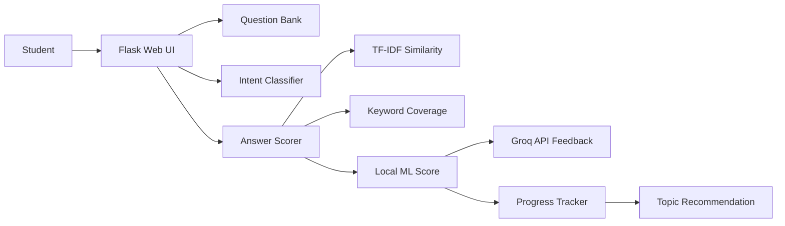

# Project Workflow

## 1. User Opens the App

The student opens the Flask web app and chooses a practice mode.

Available modes:

- Practice
- Chatbot
- Progress
- Project Fit

## 2. Question Selection

The student can select:

- Unit
- Difficulty
- Topic keyword

The app loads questions from `data/questions.json`.

## 3. Student Writes an Answer

The student types an interview-style answer in the Practice tab.

## 4. Local ML Scoring

The answer is evaluated locally before calling Groq.

Scoring has two parts:

1. **Semantic similarity**
   - Student answer and reference answer are converted into TF-IDF vectors.
   - Cosine similarity measures how close the answer is to the reference answer.

2. **Keyword coverage**
   - Each question has important keywords.
   - The app checks which keywords are present or missing.

Final score:

```text
final_score = semantic_similarity * 65 + keyword_coverage * 35
```

This gives a transparent scoring method that can be explained during viva.

## 5. Groq Feedback

After local ML scoring, the app sends the following to Groq:

- Interview question
- Reference answer
- Student answer
- Local ML score

Groq returns:

- Score explanation
- What worked
- What is missing
- Improved answer
- Follow-up question

## 6. Progress Tracking

Each evaluated answer is saved in the browser session for the current demo.

The Progress tab shows:

- Number of evaluated questions
- Average score
- Latest score
- Topic-wise performance records
- Revision suggestions

## 7. Chatbot Intent Detection

The Chatbot tab uses local ML to detect user intent.

Example:

```text
User: ask me a question about NLP
Predicted intent: question_request
```

The model uses:

- Bag-of-words feature extraction
- Multinomial Naive Bayes classifier
- Training data from `data/intents.csv`

## Simple Workflow Diagram



## Data Flow

```text
Student input
    -> intent classifier or answer scorer
    -> local ML output
    -> Groq feedback if API key is available
    -> UI response and progress update
```
